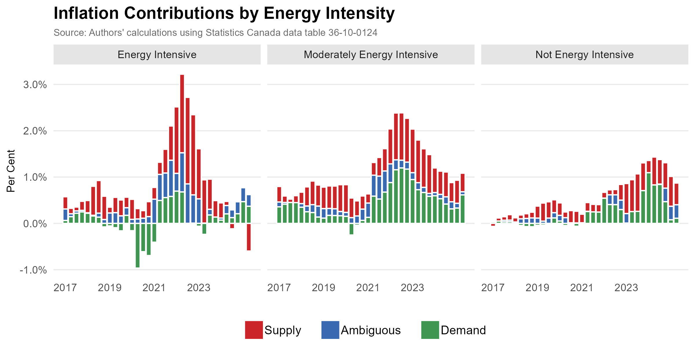

# Replication Files for Chen and Tombe (2023)

*Canadian Public Policy, forthcoming*

The latest version is available as a PDF [here](Chen_and_Tombe_2022.pdf).

Brief description of included files:

- [ReplicationClean.R](ReplicationClean.R) conducts all the main analysis and includes code to replicate all figures and tables in the paper. It fetches the most recently available data, which may have been revised since the paper's publication. Most of the data corresponds to household consumption expenditures, which are available quarterly. Monthly CPI data is also used in the analysis.
- `DataForPaper.RData` provides the data vintages used by the paper.
- [Setup.R](Setup.R) installs all necessary packages and defines themes.
- All figures and tables are provided in the [Figures](Figures) folder, based on the most recently available data. May not match what is reported in the paper due to later data revisions.

**Note:** A FRED API key is required to run the analysis. The FRED data used in the paper is provided within the DataForPaper file, but any future updates to that data require you enter your API key in the [Setup.R](Setup.R) file.

---

Selected figures:

