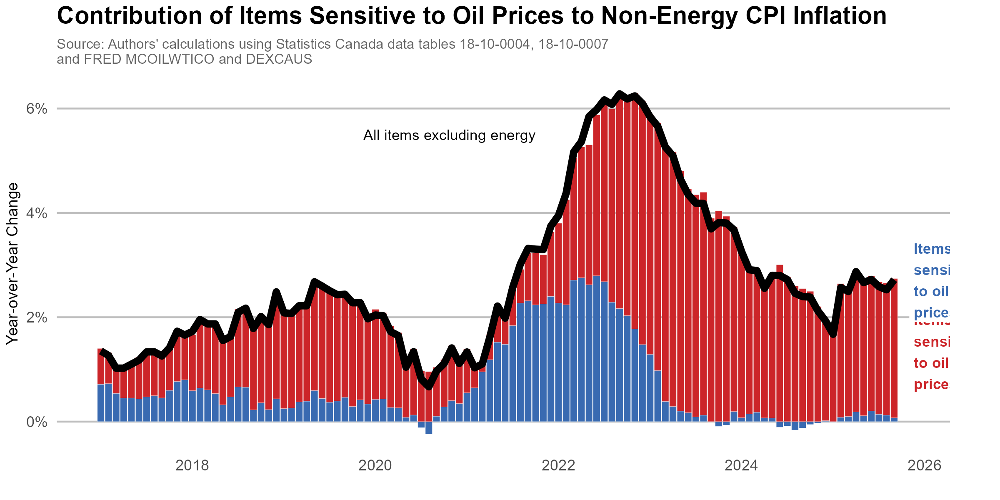
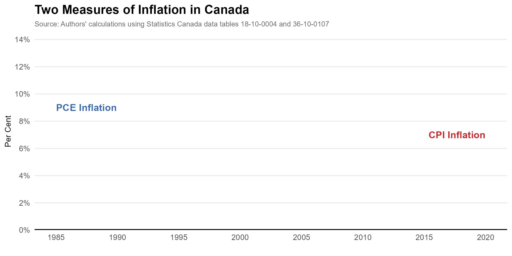
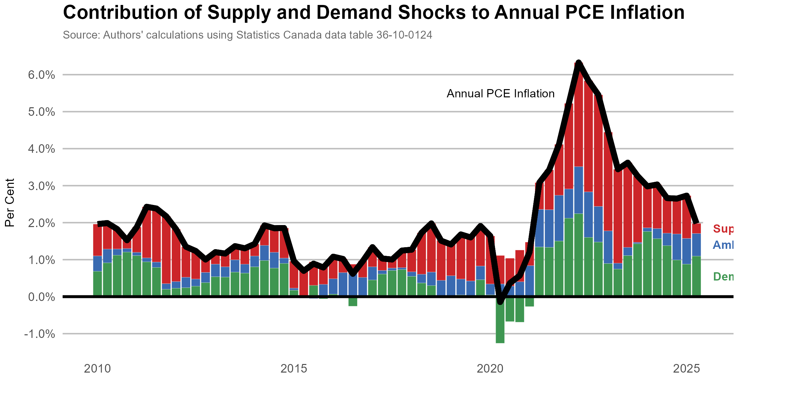

# Replication code for Chen and Tombe (2023)

*Canadian Public Policy, forthcoming*

Brief description of included files:

- [ReplicationClean.R](ReplicationClean.R) pulls all necessary data to replicate all figures and tables in the paper. It fetches the most recently available, which may have been revised since the paper's publication. 
- `DataForPaper.RData` provides the data vintages used by the paper.
- [Setup.R](Setup.R) is called by the replication file.
- All figures and tables are provided in the [Figures](Figures) folder, based on the most recently available data. May not match what is reported in the paper due to later data revisions.

**Note:** A FRED API key is required to run the analysis. The FRED data used in the paper is provided within the DataForPaper file, but any future updates to that data require you enter your API key in the "setup.R" file.

---

