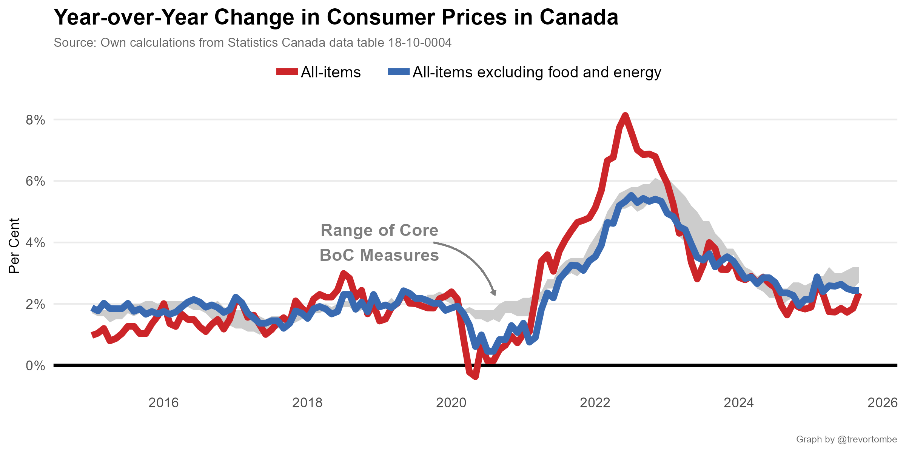
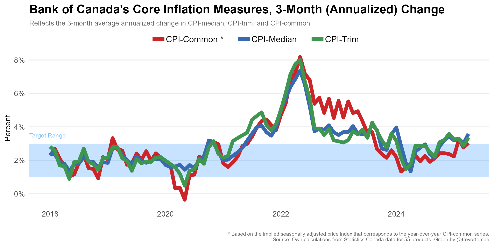
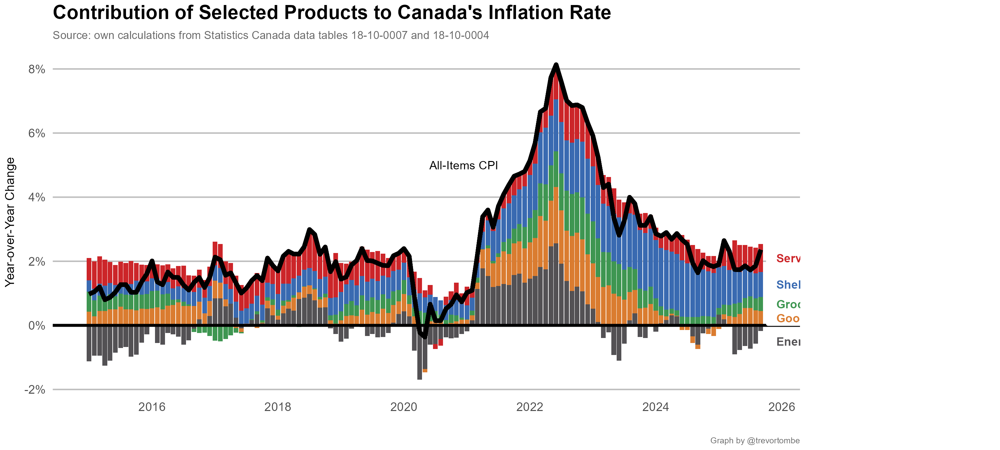
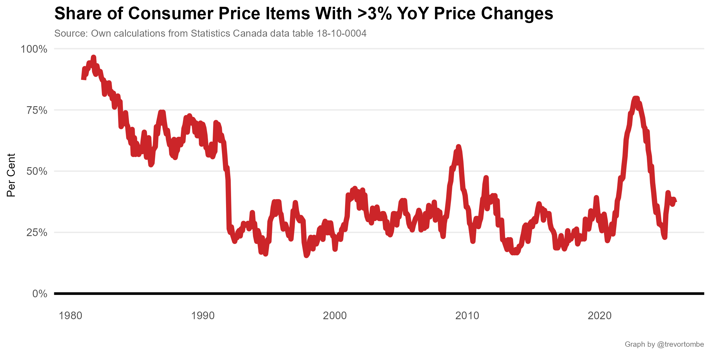
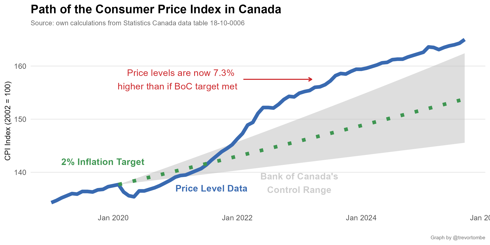

This repo contains several regularly updated calculations to better understand Canada's recent inflation experience. It will automatically fetch the latest data (normally with only a few hours delay) and regenerate the plots. This repo also houses the replication code for [Chen and Tombe (2023)](ChenTombeReplication/Chen_and_Tombe_2022.pdf), forthcoming in the journal *Canadian Public Policy*.

---

---

