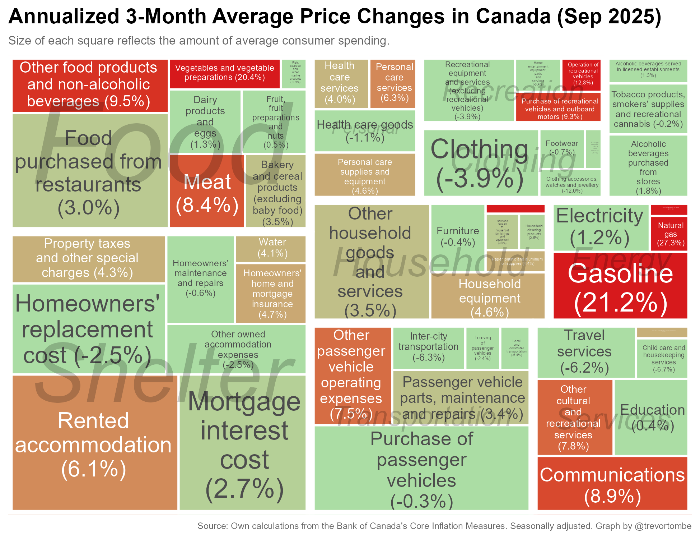
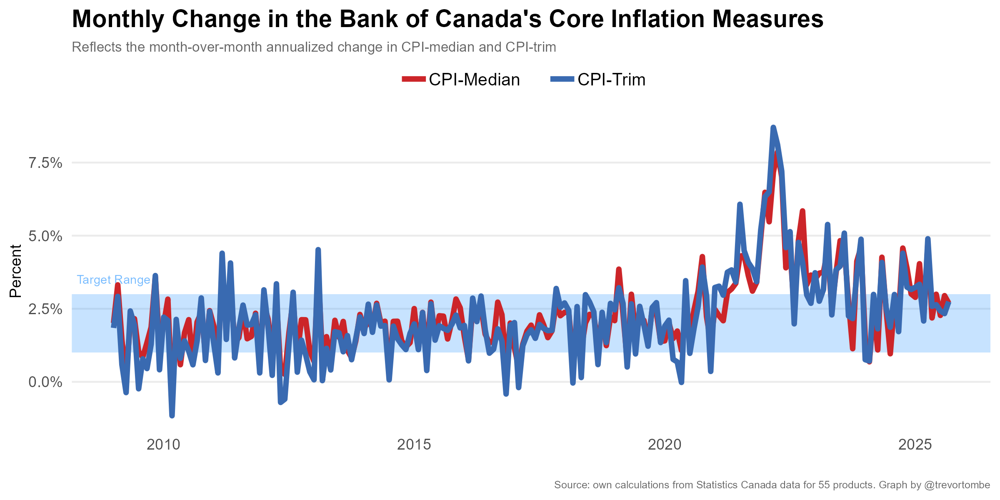
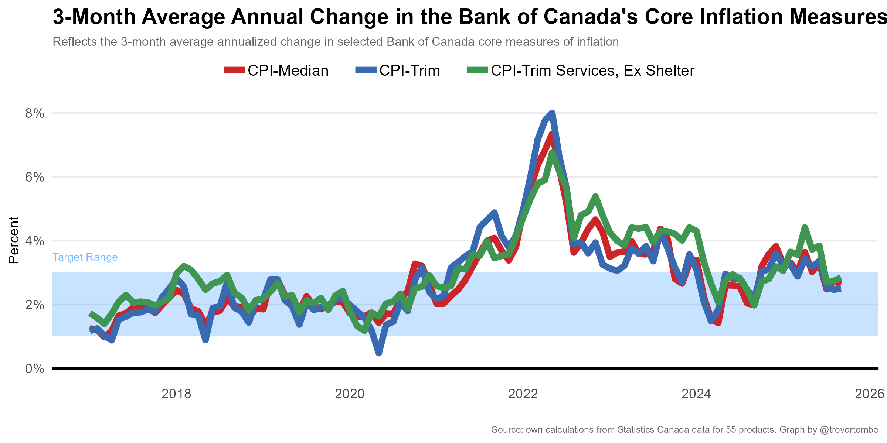
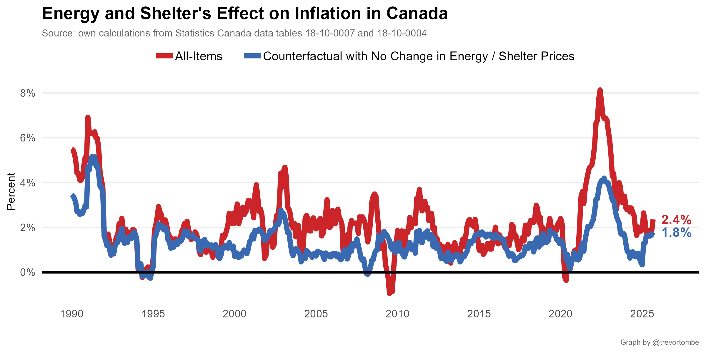
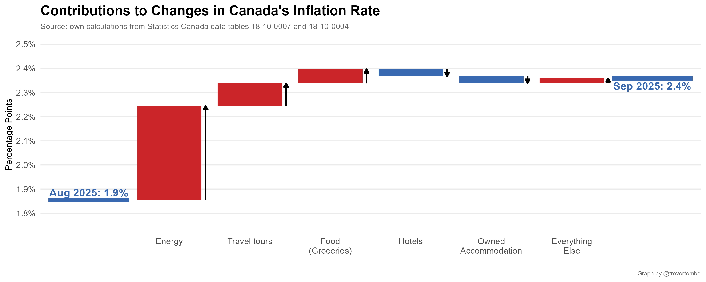

This repo contains several regularly updated calculations -- such as the recently terminated aggregate of services excluding shelter services -- and potentially informative visualizations to better understand Canada's recently high rates of inflation. It will automatically fetch the latest data (normally with only a few hours delay) and regenerate the plots.

---

