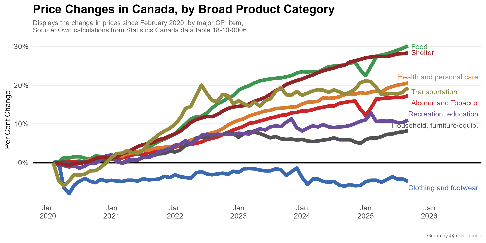
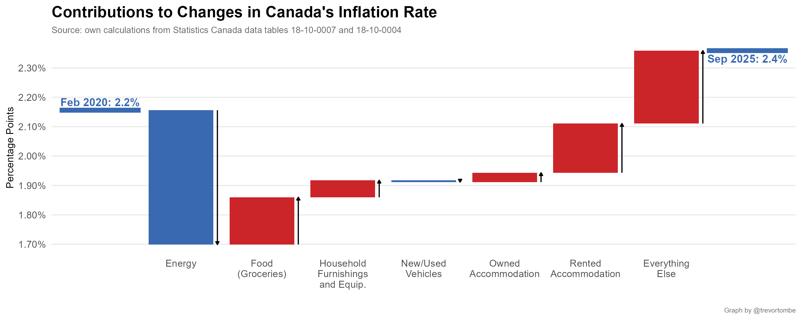

# Random Inflation Graphs

This repo contains several regularly updated calculations -- such as the recently terminated aggregate of services excluding shelter services -- and potentially informative visualizations to better understand Canada's recently high rates of inflation.

---

